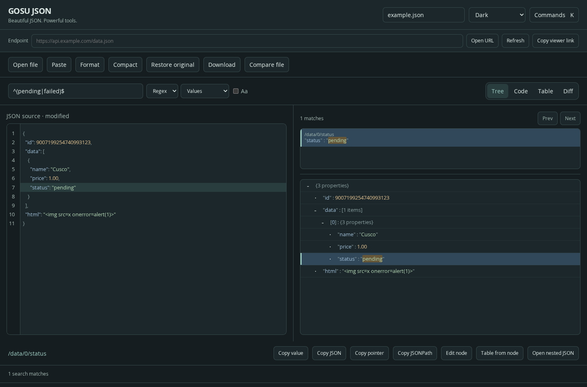

# GOSU JSON

**Beautiful JSON. Powerful tools.**

A browser extension that makes JSON easier to read, search, edit and compare. Imported documents open formatted, with colors that distinguish field names and values.

JSON is a text format applications use to exchange data. You do not need to be an expert: paste a response, drop a file or open an endpoint URL to get started.

**Version 0.4.5 — preview.** Packages are included for Chrome/Brave, Edge and Firefox, plus Safari web extension resources. Safari requires Apple packaging and signing. Native browser installation and permissions still need the checks in [TESTING.md](docs/TESTING.md); Safari runtime support is not yet verified.

[Product presentation](PRESENTATION.md) · [Privacy](PRIVACY.md) · [Publication guide](docs/PUBLISHING.md)



[See light mode](docs/images/light.png)

## Install without a terminal

The project release ZIP includes prebuilt `dist/` folders. Extract it and keep the folder: your browser will continue using its files. Downloading GitHub's source archive alone does not include `dist`; see [Development](#development) to build it.

### Chrome, Brave and Edge

1. Open `chrome://extensions`, `brave://extensions` or `edge://extensions` in your browser.
2. Turn on **Developer mode**, which allows loading an extension from a folder.
3. Click **Load unpacked**.
4. Select **`dist/chromium`** for Chrome/Brave, or **`dist/edge`** for Edge.
5. Find **GOSU JSON** in your browser's extensions menu. Pin it for easy access.

If you downloaded a browser-only ZIP, extract it and select the extracted folder itself. The selected folder must contain `manifest.json`. Selecting the project root or a ZIP causes a “Manifest file is missing or unreadable” error.

### Firefox

1. Extract the project ZIP.
2. Open `about:debugging#/runtime/this-firefox`.
3. Click **Load Temporary Add-on** and select **`dist/firefox/manifest.json`**.

This installation disappears when Firefox restarts. Permanent installation requires Mozilla signing. Store publication is pending.

### Safari on macOS

Safari cannot install the web extension ZIP directly. Use the [Safari packaging guide](docs/SAFARI.md) to generate its containing app/Xcode project, select your signing team and test in Safari. A manual GitHub Actions workflow is included for project generation on macOS; it has not yet been executed.

Mobile browser support is not claimed for this release.

## Your first JSON in one minute

1. Click the extension icon and choose **New workspace**.
2. Paste this example into the editor on the left:

```json
{ "name": "Ana", "active": true, "projects": ["Web", "API"], "visits": 42 }
```

3. Click **Format** to add readable indentation. Imported files and valid responses are formatted automatically.
4. In the right-hand **Tree**, expand `projects` to see its items.
5. Edit a value and click **Download** to save your JSON file.

You can also drag a file into the workspace. **Restore original** restores the exact received source. Formatting preserves large numbers, property order and duplicate keys; duplicates produce warnings.

**Edits affect your local copy. They do not update the original service.** Download anything you want to keep before closing or reloading: documents are not autosaved.

## Try the complete example

Open [playground.json](examples/playground.json) to explore 6 fictional users, 120 orders, nested JSON, Unicode and precise numbers. Follow the [five-minute guided tour](examples/README.md) to try every view, regex search, editing and a comparison file with five intentional changes. No API or account is needed.

## Choose how to explore

The left panel is your editable source. The view buttons on the right change the right panel.

| View      | What it helps you do                                                                |
| --------- | ----------------------------------------------------------------------------------- |
| **Tree**  | Expand and collapse objects and lists without reading the whole document.           |
| **Code**  | Read colored JSON; make edits in the left-hand editor.                              |
| **Table** | Inspect a list of objects in rows and columns. Select a suitable array in the tree. |
| **Diff**  | Find differences against a file selected with **Compare file**.                     |

Copy a value, exact JSON or its path. A path identifies where a value lives; JSON Pointer and JSONPath copy formats are available. Executable JSONPath queries are not implemented yet.

Select a string containing another JSON document and use **Open nested JSON** to inspect it in a separate workspace.

## Export a table

Select an array in Tree, then choose **Table**. Use **Export CSV** or **Excel (.xml)** above the table. Both export **all rows of that array**, including rows on other pages, with the same first 50 data columns and the row index shown in the table. Search highlights do not filter the export.

CSV uses UTF-8, preserves commas, quotes and line breaks, and stores nested objects/arrays as compact JSON text. Formula-like text is prefixed with an apostrophe for safer spreadsheet opening. CSV carries no column types: when importing it in Excel, select Text for columns containing long IDs or exact decimals to prevent automatic conversion.

The basic Excel option creates an **XML Spreadsheet 2003** file, not `.xlsx`. All cells are text, preserving IDs, exact number spellings and formula-like values. Open the `.xml` file in Excel and save as `.xlsx` if needed. It supports up to 65,535 data rows and 32,767 characters per cell; use CSV for larger data. Exports are generated locally in the worker and capped at 50 MiB. Exporting does not modify your JSON.

## Open JSON from a URL

An **endpoint** is a service URL that returns data. There are two ways to open it:

- **A response already open in your browser:** when the server declares a JSON document, GOSU JSON opens its existing contents in a separate tab without fetching them again. A banner offers **Always on this site** or **Only when I choose**. Until you decide, that question remains visible on future imports. Change your choice from the extension popup.
- **Inside the workspace:** paste a URL into **Endpoint** and click **Open URL**. This makes a new request. **Refresh** requests it again.

If automatic capture is blocked, try **Open current JSON page**, copy/paste or file import. Native JSON viewers can interfere, particularly in Firefox. Ordinary HTML pages do not trigger automatic opening; plain-text page import requires a manual action.

**Copy viewer link** creates a bookmarkable link that opens the viewer and requests that endpoint. The link belongs to your installed extension; it may not work in another profile/browser/computer. Query parameters are preserved. Never share a link containing private tokens.

URL requests use GET (reading only), without session cookies or authentication credentials, and may follow server redirects. Services requiring login may not work here even if they work in a normal tab. Custom authentication headers and POST/PUT requests are not supported. Invalid, failed or cancelled requests preserve the previous document. HTTP error responses containing valid JSON can be inspected.

## Find a value quickly

Search field names (**Keys**), **Values**, or both. You can match case or require an exact text match.

Turn on **Regex** for regular expressions: patterns that match different forms of text. For example, `@example\.com$` finds values ending in `@example.com`.

Click a result to expand its ancestors and highlight the value in the tree and source. Tree rows and search results render only the visible window. Tables are paginated. Regex searches run in an isolated worker and are cancelled after two seconds.

## Appearance and shortcuts

Choose system, light or dark theme. Each palette distinguishes keys, strings, numbers, booleans and `null`.

| Action          | Windows / Linux  | macOS           |
| --------------- | ---------------- | --------------- |
| Command palette | Ctrl + K         | Cmd + K         |
| Download        | Ctrl + S         | Cmd + S         |
| Format          | Ctrl + Shift + F | Cmd + Shift + F |

Source editing, formatting and node replacement support undo/redo.

## Privacy you can inspect

This version has no ads, affiliate scripts, telemetry, geolocation requests or remote code. No account is needed. Documents are processed locally and are not uploaded to a GOSU JSON service. The source is available under the MIT license.

**Opening or refreshing a URL uses the network.** The endpoint and its redirects receive the request and can see your IP. Viewer links include the endpoint URL; browser bookmarks/history may retain them.

Automatic JSON detection needs broad HTTP/HTTPS site access. The current content script checks document type and exits on ordinary non-JSON pages. Choosing manual opening does not revoke that permission. You can restrict website access in browser settings, but automatic detection may stop working.

Only the theme and per-site opening preferences are saved locally. Documents remain in session memory. See [PRIVACY.md](PRIVACY.md) for permissions and source references. Source availability alone does not prove that a distributed package matches the source.

## Current limits

- **10 MiB**, **100,000 nodes**, **128 nesting levels**. Not intended for gigabyte-sized files.
- Up to **1,000 search results**; regex patterns up to **512 characters**.
- Tables: **100 rows per page**, first **50 columns**.
- Diff: up to **2,000 changes**. Arrays compare by index; object property order is ignored.
- Endpoint timeout: **30 seconds**.
- Strict JSON only. JSONC comments, NDJSON and JSON Schema validation are not implemented.
- Restricted browser pages and `file://` capture are unsupported. Drop local files into the workspace instead.

## Update an existing installation

Replace files at the same installed folder path and reload the extension. Keeping that path preserves Chromium's unpacked-extension ID and preferences. The former JSON Atelier Firefox identifier is intentionally retained for continuity; keep the eventual published ID stable.

## Report a problem or contribute

Open an issue in the repository with your browser version, steps and expected behavior. Include a small JSON example with fictional data, never passwords, tokens or personal information.

For code changes, read [CONTRIBUTING.md](CONTRIBUTING.md). Report security problems through [SECURITY.md](SECURITY.md).

## Development

### One command with Docker or Podman (recommended on Linux)

Install **Make** and either **Docker** or **Podman**. Node.js, npm and Python run inside a project-specific development container, so you do not need them installed on your computer.

From the project directory:

```bash
make help
make all
```

`make all` builds the tools image, installs locked dependencies, runs unit tests, builds all four browser packages, checks syntax/permissions and formatting, then writes release ZIPs and checksums to `releases/`. Each step stops the workflow if it fails. It does not launch browser UI tests or native Safari packaging.

The first run downloads the container image and packages. Later runs reuse Docker/Podman image layers. Output files belong to your Linux user. `node_modules/`, `dist/` and `releases/` stay inside the project directory. No background container or service is left running.

If you use Podman:

```bash
make all ENGINE=podman
```

On CachyOS, if Make/Podman are not already installed:

```bash
sudo pacman -Syu make podman
make all ENGINE=podman
```

If both engines are installed, Docker is selected by default. Select Podman explicitly when you prefer it or Docker is not running. Docker must be usable by your account; do not run `sudo make all`. The container runs with your user/group ID so generated files are not owned by root. If your existing project files were created by root, correct their ownership before running the workflow.

To check tool versions, run `make versions`. For individual commands, see `make help`. After `make all`, load `dist/chromium` using your browser's **Load unpacked** action or upload `releases/gosu-json-chromium-0.4.5.zip` to Chrome Web Store.

### Without containers (optional)

Requires **Node.js 24+**; ZIP packaging also requires **Python 3**.

```sh
npm ci
npm test
npm run build
npm run check
npm run format:check
npm run package
```

`npm ci` installs the locked dependencies. `build` creates browser resources in `dist`; `package` writes ZIPs and a checksum file to `releases`.

On macOS with Xcode: `npm run safari:project`. Preview its arguments on any platform: `npm run safari:project -- --dry-run`.

See [architecture](docs/ARCHITECTURE.md), [validation](docs/VALIDATION.md), [manual tests](docs/TESTING.md), [publishing](docs/PUBLISHING.md), [Safari](docs/SAFARI.md), [Edge](docs/EDGE.md), [roadmap](docs/ROADMAP.md) and [dependency licenses](THIRD_PARTY_NOTICES.md).

---

If GOSU JSON helps you, you can optionally [support its development via PayPal](https://www.paypal.com/paypalme/remasterizado). Thank you for your support.

### Updating the release version

Change only `version` in `package.json`, then run `make all`. The container synchronizes the lockfile, validates the project and builds all browser manifests and versioned ZIP files. `make package` rejects stale builds. No host Node installation is required.
